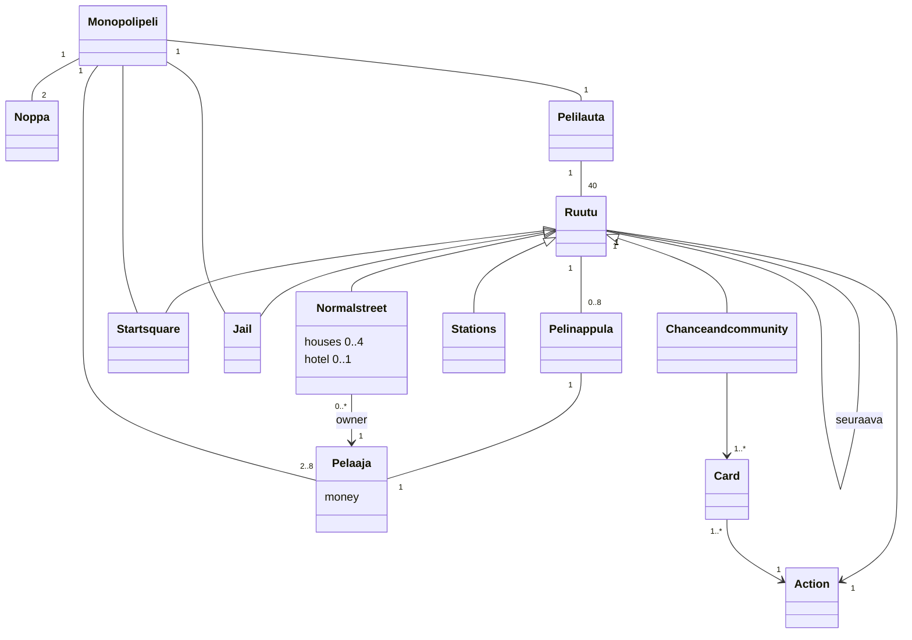

# Monopoli, alustava luokkakaavio

```mermaid
 classDiagram
    Monopolipeli "1" -- "2" Noppa
    Monopolipeli "1" -- "1" Pelilauta
    Pelilauta "1" -- "40" Ruutu
    Ruutu "1" -- "1" Ruutu : seuraava
    Ruutu "1" -- "0..8" Pelinappula
    Pelinappula "1" -- "1" Pelaaja
    Pelaaja "2..8" -- "1" Monopolipeli
    Ruutu <|-- Startsquare
    Ruutu <|-- Jail
    Ruutu <|-- Chanceandcommunity
    Ruutu <|-- Stations
    Ruutu <|-- Normalstreet
    Ruutu "1" --> "1" Action
    Chanceandcommunity -->  "1..*" Card
    Normalstreet "0..*" --> "1" Pelaaja: owner
    class Pelaaja{
        money
    }
    class Normalstreet{
        houses 0..4
        hotel 0..1
    }
    Card "1..*" --> "1" Action
    Monopolipeli -- Startsquare
    Monopolipeli -- Jail 


```